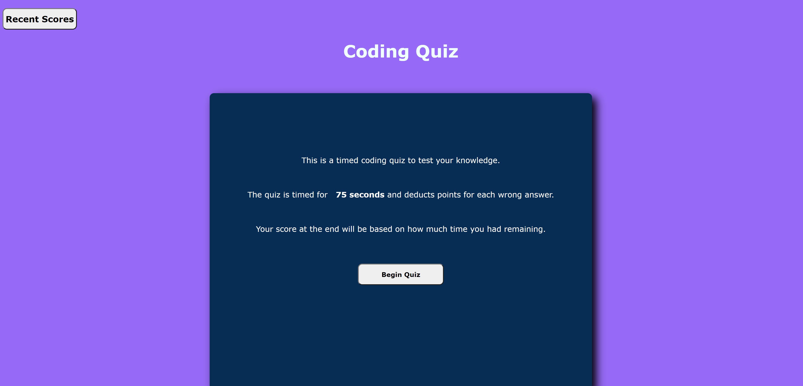

# General-Coding_Quiz

## Description

This project was attempting to create a coding quiz with mostly javascript. This tool gives me an easy way to study up on terminology for certain coding things, as well as putting in to practice the stuff I learned during the first few weeks of the course. I still have a long way to go in terms of the technical stuff but I am slowly understanding the workings of it all.

## Installation

N/A

# Usage

[Link to the Quiz](https://sofuto22.github.io/General-Coding_Quiz/)

# Credits

N/A

# License

None
